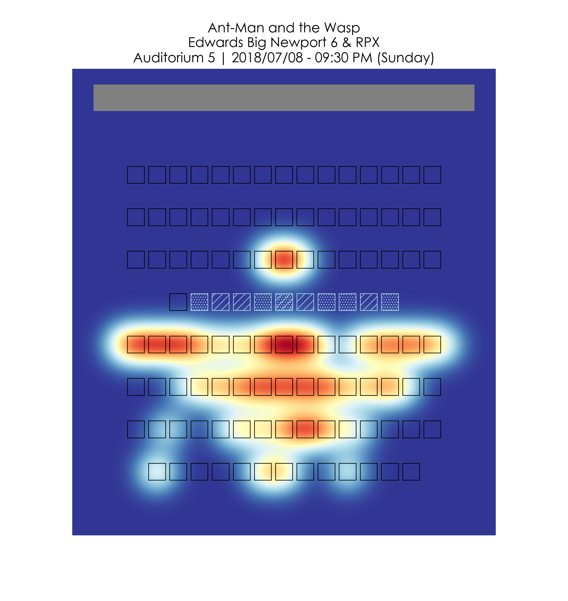

# Movie Theater Seating Demand

_What seats in a movie theater are most highly valued?_

## Intro

In this project, I attempt to get a qualitative understanding of movie theater seating demand through a combination of web-scraping and exploratory data analysis. My guiding assumption is that the earlier a seat is reserved, the higher its demand. Below are a few examples of plots that resulted from my experiments:




## Goal

Create a heat-map of a theater seating-chart indicating the average demand of a seat given its position relative to the screen. Do this using a sort of Gaussian kernel density estimation where the value of a position in a theater corresponds to the average fraction of open seats in the theater when a seat at that position is reserved.

## Resources
* [Web Scraping Tutorial](https://youtu.be/52wxGESwQSA) | YouTube video
* [Associated GitHub repo](https://github.com/paulproteus/python-scraping-code-samples) | GitHub repo with web scraping demo
* [MechanicalSoup Tutorial](http://mechanicalsoup.readthedocs.io/en/stable/tutorial.html) | Library doc
* [BeautifulSoup4 Documentation](https://www.crummy.com/software/BeautifulSoup/bs4/doc/) | Library doc
* [Some Selenium stuff](http://stanford.edu/~mgorkove/cgi-bin/rpython_tutorials/Scraping_a_Webpage_Rendered_by_Javascript_Using_Python.php) | Stanford web scraping tutorial
* [Add ChromeDriver to path](https://youtu.be/dz59GsdvUF8) | YouTube video
* [Fandango API](https://developer.fandango.com/docs/read/Fandango) | Fandango developer doc

## Web Scraping Fandango
* The Fandango API is unfortunately not flexible enough to allow the kind of data acquisition that this project requires, so we have to resort to web scraping.
* An ideal solution would involve direct access to a Fandango streaming API which would contain an event for every ticket purchase so that we know the timestamp at which each seat in each movie showing was purchased and where in the theater that seat is located. Since this is not possible, we can approximate this by choosing a subset of movie showings to follow, then taking snapshots of the seating chart availability for those showings at fixed intervals throughout each day.
* To scrape a snapshot of seating chart availability, the most straightforward approach is to simply pretend to purchase a ticket on Fandango, clicking through the selection process until the seating chart is shown, download the seating information from the webpage, then exiting before actually making a selection.
* Because Fandango dynamically generates content as a user navigates through the ticket selection process, we can't just use REST APIs to collect our data. To allow the webpage's Javascript to run, we use a webdriver (Selenium).

## Generating a Seating Chart Layout

### Seating Convention Notes:

* Every seat is labeled with a letter (indicating row) and a 1-indexed number (indicating column).
  * Some theaters, however, indicate wheelchair seats with the character combination "WC" instead of the row letter to which that seat belongs.
* Row letters increase from the **front** to the **back** of the theater (from closest to farthest from the screen).
* Column numbers increase from **house right** to **house left** (i.e., right to left when the screen is in front of you).
* Not every row is guaranteed to have the same number of columns.
* Sometimes, a row may have missing column numbers due to walkways, handicap spaces, or unusual seating arrangements.

### Visualization Notes:

* If a column number is missing for a given row in a seating chart, I will assume that the lack of this column number accounts for a physical gap in the seating chart. Thus, I will take the number of columns in a row to be equal to the highest column number in that row specified by the seating chart. All resulting gaps will be treated as seats with 0 demand.
* Since theaters come in many shapes and sizes, I will map all seating charts onto a standardized square grid. This mapping process is 2 steps:
  * Map the seats onto a rectangular space such that if a theater has N rows and M columns, the rectangle can be populated with N * M square-packed circles of equal radius (where each circle represents 1 seat located approximately at the circle's center).
    * We can account for leg-room by multiplying the vertical distance by some constant leg-room factor.
  * Then stretch the rectangle (and the circles that fill it) vertically or horizontally so that the seats fill the space of a square.
* I will assume that every seat in a theater is the same size.
* I will assume that each row is centered along the axis which divides the theater into a left and right half. Thus, if a row has fewer columns than the highest possible number of columns in that theater, the permanently unoccupied space at the left and right edges of that row will be be treated as seats with 0 demand.
* Choosing a colormap: https://matplotlib.org/users/colormaps.html

## Creating a Heatmap

* At each reserved seat, generate a Gaussian blip to indicate that the seat is reserved.
* The magnitude of the blip should be related to the "demand" implied by that seat reservation. The more of the theater's seats remain when that seat is reserved, the higher the Gaussian blip. To make sure this is standardized regardless of theater size, we can control the blip magnitude with the _proportion_ of seats remaining. We can also apply an exponential scaling factor to this proportion to non-linearly weight seating demand (e.g. earlier reserved seats are more important to distinguish from each other than later reserved seats are.)
* To control the appearance of the resulting heatmap, we can specify a set of plotting parameters:
```python
plotting_params = {    
    "blip_width": 1,       # size of Gaussian blip relative to x-distance between adjacent seat centers
    "seat_width": 0.8,     # size of seat bounding box relative to x-distance between adjacent seat centers
    "leg_room": 2,         # ratio of y-dist./x-dist. between two vert./horiz. adjacent seat centers
    "resolution": 200,     # number of points to be computed across one dimension of the heat-map domain
    "p": 2,                # power (exponent) for non-linearly weighting seat demand values
    "N": 1000              # number of contour levels to be plotted
}
```

## Future Work

* **Fandango API**: revisit the Fandango API to see if there have been any useful developments.
* **Web scraper parallelization**: The current version of my web scraper repeatedly iterates through a small number of pre-selected movie showings automatically, but it does so serially. We should be able to speed this up by parallelizing the scraping process. Care should be taken to not increase traffic too much, otherwise we may be stopped for being a bot.
* **VPN**: Use a VPN so that my IP address doesn't get banned if I screw up.
* **Server**: Everything is being done on my local machine currently. Since this process requires runs all-day long, this is not ideal. Consider using a cloud processing service host the scraper.
* **Organization** All the Python code is in notebooks right now. Code should be modularized and put into a deployable library. Commented-out code should be cleaned up.
* **Aggregate Visualization**:
  * So far, all the heatmaps I've generated apply to only single showings. Consider combining data across many showings to show a "universal heatmap".
  * Consider embedding each individual showing as a vector in some feature space. Use UMAP to reduce the dimensionality of the collection of all showings. Observe clustering. This may be useful because there's likely not a single "universal" heatmap that really describes seating demand within theaters. There may be a number of common seating demand patterns, maybe dependent on which seats are chosen first (locking off certain areas), large groups attending a showing together, time of day dependencies, movie genre dependencies, "opening night" effects, etc.
